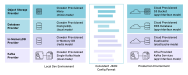

# 


## What is Clowder?

Clowder is a kubernetes operator designed to make it easy to deploy applications
running on the cloud.redhat.com platform in production, testing and local
development environments.


## See Clowder in Action


## Why use Clowder?

In addition to reducing the effort to maintain a deployment template, Clowder 
provides a number of other benefits:

- **Consistent deployment** Whether you're deploying to production, running smoke
  tests on a PR, or developing your application locally, Clowder will use the 
  same app definition for all three. No more endlessly tweaking environment variables! 
- **Focus on development** Clowder has the best practices of running an app in
  a microservices environment as well as specific requirements from the app-sre
  team, such as pod affinity, rollout parameters etc built-in. Spend less time
  worrying about configuring deployment templates and more time writing your app.
- **Assisting Ops** Any dev or SRE that learns how Clowder deploys apps will
  implicitly understand the deployment of any other app utilizaing Clowder.
- **Deploy a full environment locally** Gone are the days of hacking together
  scripts that just about get you mocked or partially working dependant services.
  With  Clowder, you can deploy an instance of the cloud.redhat.com platform on your
  local laptop, or in a dev cluster to use as you wish.

Clowder will provision resources depending on the mode choosen for each provider,
and will return a consistently formatted JSON configuration document for each app
to consume, leaving teams to focus more on writing code than differences between
environments. The Clowder config client can assist with this and currently has support
for Python, Go, Javascript and Ruby.



## Roadmap

Our current roadmap looks like this:

- Jobs Support (End of Q1)
- Autoscaling (possibly via [Keda](https://github.com/kedacore/keda))
- Dynamic routing for public web sevices
- Automatic metrics configuration
- Automatic network policy configuration
- Standard, configurable alerting: Error rate, latency, Kafka topic lag, etc
- Canary deployments (possibly via [Flagger](https://github.com/weaveworks/flagger))
- Operational remediations
- Observe service status from a `ClowdApp` `status`, based on sevice dependencies.
- Istio integration
- Advanced logging configurations (e.g. logging messages to kafka topics)

## Getting Clowder

**Clowder is already running in pre-prod/prod environments.**

To run Clowder locally in Minikube, obtain and install 
[Minikube](https://minikube.sigs.k8s.io/docs/start/).

Clowder is developed on Fedora and the kvm driver has been found to work best
initiated with the following options:

  ```
  minikube start --cpus 4 --disk-size 36GB --memory 8000MB
  ```

Clowder can then be installed by visiting the 
[latest release](https://github.com/RedHatInsights/clowder/releases/latest) 
page copying the link to the manifest and running something similar to that
shown below:

  ```
  minikube kubectl -- apply -f https://github.com/RedHatInsights/clowder/releases/download/0.2.0/clowder-manifest-0.2.0.yml --validate=false
  ```
## Usage

To use Clowder to deploy an application a `ClowdEnvironment` resource must be
present to define an environment. Once this has been deployed, a `ClowdApp` 
resource is authored for the app and deployed alongside the `ClowdEnvironment`.

Example app developer workflow:

1. Install Clowder on a minikube environment.
2. Use `kubectl apply -f clowdenv.yaml` to apply a `ClowdEnvironment` resource
   to the cluster.
3. Use `kubectl apply -f clowdapp.yaml` to apply a `ClowdApp` resource to the
   cluster.

More details on how to do this are present in the [learning](docs/how-to-use.md) section
of the documentation.

[API Reference](https://redhatinsights.github.io/clowder/api_reference.html)

## Building Clowder

If you want to run a version of Clowder other than the released version there
are a few prerequisites you will need. To learn about developing Clowder please
visit the [developing clowder](page) page for more detailed instructions.

## History

To understand more about the design decisions made while developing Clowder,
please visit the [design document](docs/clowder-design.rst)

## Connect

Any questions, please ask one of the Clowder development team

- [@kylape](https://github.com/kylape)
- [@psav](https://github.com/psav)
- [@bsquizz](https://github.com/bsquizz)
- [@BlakeHolified](https://github.com/BlakeHolifield)
- [@bennyturns](https://github.com/bennyturns)
