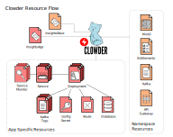

# Clowder :cat: - Insights Platform Operator

An operator to deploy and operate cloud.redhat.com resources for Openshift.


## Overview

The Clowder operator takes much of the heavy lifting out of creating and 
maintaining applications on the Clouddot platform. Instead of an app developer
being responsible for authoring multiple resources and combining them into a
single k8s template, the Clowder app defines a simple `ClowdApp` resource
which not only defines the pods for the application, but also requests certain
key resources from the environment, such as Object Storage Buckets, a Database,
Kafka Topics, or an In Memory Database.

A `ClowdEnvironment` resource is used to define how key resources, such as
Kafka Topics and Databases are deployed. Using different providers, a single
`ClowdEnvironment` can radically alter the way in which resources are
provisioned. For example, with regards to Kafka Topics, setting the `provider`
to `local` will instruct Clowder to deploy a local Zookeeper/Kafka pod
and create topics inside it, but if the provider were set to `operator`, then
Clowder would instead drop a KafkaTopic custom resource ready for the Kafka
Strimzi operator to pick up and create topics.

The diagram below shows how the two Clowder resources are used to create all
other k8s resources.



Once these custom resources have been created and deployed to the k8s
environment, the operator will create a secret with all necessary configuration
data and expose it to the pods by mounting the JSON document in the app 
container. In this way, instead of an app configuring itself, the app is
configured instead by Clowder.

This has the advantage of creating consistency across deployments, whether
they are development, testing or production. It also creates a simple interface
for developers to onboard, producing a more streamlined developer experience.

The `ClowdApp` resource does not change when deploying into environments
configured with different `ClowdEnvironment` resources. Though the underlying
environmental resources, object storage, kafka, etc, may be provided through
different implementations, the configuration that is presented to the pod
remains consistent.

If the application is written in Python or Go, there is a client available
which further simplifies the process of obtaining configuration and offers
several helpers for accessing some of the more complex structures.

The diagram below describes how the application accesses the configuration.


## Why use Clowder?

In addition to reducing the effort to maintain a deployment template (as stated
above), Clowder providers a number of other benefits:

- **Deploy ephemeral environments**, used to run integration tests in a PR check,
  run performance tests, or deploy an isolated environment to develop against a
  feature branch.
- **Maintain compliance with operational guidelines** laid out by App SRE.  A few
  of these include pod affinity, rollout parameters, and image pull policy.
- **Maximize consistency** between apps.  Any dev or SRE that learns how one
  Clowder app is deployed then understands many aspects about how _any_ app on
  Clowder is deployed.
- **Deploy a full environment locally**, e.g. Codeready containers or a remote
  cluster for personal use.

There are new features coming up as well:

- Autoscaling (possibly via [Keda](https://github.com/kedacore/keda))
- Dynamic routing for public web sevices
- Automatic metrics configuration
- Automatic network policy configuration
- Standard, configurable alerting: Error rate, latency, Kafka topic lag, etc
- Canary deployments (possibly via [Flagger](https://github.com/weaveworks/flagger))
- Operational remediations
- Observe service status from a `ClowdApp` `status`, based on sevice dependencies.
- Istio integration
- Advanced logging configurations (e.g. logging messages to kafka topics)

## CRD documentation

- [ClowdApp](https://redhatinsights.github.io/clowder/api_reference.html#k8s-api-cloud-redhat-com-clowder-v2-apis-cloud-redhat-com-v1alpha1-clowdapp)
- [ClowdEnvironment](https://redhatinsights.github.io/clowder/api_reference.html#k8s-api-cloud-redhat-com-clowder-v2-apis-cloud-redhat-com-v1alpha1-clowdenvironment)

## AppConfig documentation

- [AppConfig](https://github.com/RedHatInsights/clowder/blob/master/docs/appconfig/schema.md)

## Design

[Design docs](https://github.com/RedHatInsights/clowder/tree/master/docs/)

## Dependencies

- [Operator SDK](https://github.com/operator-framework/operator-sdk/releases)
- [kubebuilder](https://github.com/kubernetes-sigs/kubebuilder/releases)
- [kustomize](https://github.com/kubernetes-sigs/kustomize/releases)
- Either Codeready Containers or a remote cluster where you have access to
  create CRDs.

## Running

- `make install` will deploy the CRDs to the cluster configured in your kubeconfig.
- `make run` will build the binary and locally run the binary, connecting the
  manager to the Openshift cluster configured in your kubeconfig.
- `make deploy` will try to run the manager in the cluster configured in your
  kubeconfig.  You likely need to push the image to an image stream local to
  your target namespace.
- `make genconfig` (optionally) needs to be run if the specification for the config
  has been altered.

## Testing

### Unit Testing

The tests rely on the test environment set up by controller-runtime.  This enables the operator to 
get initialized against a control plane just like it would against a real OpenShift cluster.

1. Download and install `kubebuilder`.
[See install instructions here](https://book.kubebuilder.io/quick-start.html#installation).

2. Normally kubebuilder is installed to `/usr/local/kubebuilder/bin`. You should see the following
executables in that directory:
    ```
    etcd  kube-apiserver  kubebuilder  kubectl
    ```
    You may want to append this directory to your `PATH` in your `.bashrc`, `.zshrc`, or similar.

    **NOTE**: If you choose to place the kubebuilder executables in a different path, make sure to
    use the `KUBEBUILDER_ASSETS` env var when running tests (mentioned in step 4 below)

3. Download and install `kustomize`.
[See install instructions here](https://kubernetes-sigs.github.io/kustomize/installation/binaries/).
This places a `kustomize` binary in whatever directory you ran the above script in. Move this binary
to a folder that is on your `PATH` or make sure the directory is appended to your `PATH`

4. Run the tests:
    ```
    make test
    ```

    If kubebuilder is installed somewhere other than `/usr/local/kubebuilder/bin`, then:
    ```
    KUBEBUILDER_ASSETS=/path/to/kubebuilder/bin make test
    ```

If you're just getting started with writing tests in Go, or getting started with Go in general, take
a look at https://quii.gitbook.io/learn-go-with-tests/

### E2E Testing

Clowder offers two e2e testing scripts, one for pushing up the image into quay, and one for pushing
into a minikube local registry.

For Quay based testing use something like

  ```
  IMAGE_NAME=quay.io/username/clowder KUBEBUILDER_ASSETS=path/to/kubebuilder_assets
  ```

To use local testing completely within minikube, you must first enable the local registry

  ```
  minikube addons enable registry
  ```

The minikube command is slightly different, as the minikube instance seems to only be able to use
HTTP from 127.0.0.1.

  ```
  KUBEBUILDER_ASSETS=~/kubebuilder_2.3.1_linux_amd64/bin/ IMAGE_NAME=127.0.0.1:5000/clowder IMG_PUSH_REPO=`minikube ip`:5000/clowder ./e2e-test-local.sh
  ```

## Developing Locally with CRC

You can spin up Clowder in crc and test changes to your ClowdEnvironment and ClowdApp locally.

[CRC Guide Getting Started](https://github.com/RedHatInsights/clowder/blob/master/docs/crc-guide.md)


## Migrating an App to Clowder

[Insights App Migration Guide](https://github.com/RedHatInsights/clowder/tree/master/docs/migration)

## Doc generation

### Prerequisites

The API docs are generated by using the [crd-ref-docs](https://github.com/elastic/crd-ref-docs) tool
by Elastic. You will need to install `asciidoctor`:

On Fedora use:

  ```
  sudo dnf install -y asciidoctor
  ```

For others, see: https://docs.asciidoctor.org/asciidoctor/latest/install/


### Building docs

Build the docs using:

  ```
  ./build_docs.sh
  ```

Then be sure to add doc changes before committing:

  ```
  git add docs/api_reference.html`
  ```

### AppConfig

The AppConfig docs are generated using the [jsonschema2md](https://github.com/adobe/jsonschema2md) tool
by Adobe. Once installed via npm, simply run:

  ```
  ./node_modules/.bin/jsonschema2md -d workspace/clowder/controllers/cloud.redhat.com/config/ -o workspace/clowder/docs/appconfig -e json
  ```
