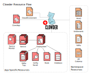

# 


## Overview

The Clowder operator takes much of the heavy lifting out of creating and 
maintaining applications on the Clouddot platform. Instead of an app developer
being responsible for authoring multiple resources and combining them into a
single k8s template, the Clowder app defines a simple `ClowdApp` resource
which not only defines the pods for the application, but also requests certain
key resources from the environment, such as Object Storage Buckets, a Database,
Kafka Topics, or an In Memory Database.


A `ClowdEnvironment` resource is used to define how key resources, such as
Kafka Topics and Databases are deployed. Using different providers, a single
`ClowdEnvironment` can radically alter the way in which resources are
provisioned. For example, with regards to Kafka Topics, setting the `provider`
to `local` will instruct Clowder to deploy a local Zookeeper/Kafka pod
and create topics inside it, but if the provider were set to `operator`, then
Clowder would instead drop a KafkaTopic custom resource ready for the Kafka
Strimzi operator to pick up and create topics.

The diagram below shows how the two Clowder resources are used to create all
other k8s resources.



Once these custom resources have been created and deployed to the k8s
environment, the operator will create a secret with all necessary configuration
data and expose it to the pods by mounting the JSON document in the app 
container. In this way, instead of an app configuring itself, the app is
configured instead by Clowder.

This has the advantage of creating consistency across deployments, whether
they are development, testing or production. It also creates a simple interface
for developers to onboard, producing a more streamlined developer experience.

The `ClowdApp` resource does not change when deploying into environments
configured with different `ClowdEnvironment` resources. Though the underlying
environmental resources, object storage, kafka, etc, may be provided through
different implementations, the configuration that is presented to the pod
remains consistent.

If the application is written in Python or Go, there is a client available
which further simplifies the process of obtaining configuration and offers
several helpers for accessing some of the more complex structures.

The diagram below describes how the application accesses the configuration.


## Why use Clowder?

In addition to reducing the effort to maintain a deployment template (as stated
above), Clowder providers a number of other benefits:

- **Deploy ephemeral environments**, used to run integration tests in a PR check,
  run performance tests, or deploy an isolated environment to develop against a
  feature branch.
- **Maintain compliance with operational guidelines** laid out by App SRE.  A few
  of these include pod affinity, rollout parameters, and image pull policy.
- **Maximize consistency** between apps.  Any dev or SRE that learns how one
  Clowder app is deployed then understands many aspects about how _any_ app on
  Clowder is deployed.
- **Deploy a full environment locally**, e.g. Codeready containers or a remote
  cluster for personal use.

There are new features coming up as well:

- Autoscaling (possibly via [Keda](https://github.com/kedacore/keda))
- Dynamic routing for public web sevices
- Automatic metrics configuration
- Automatic network policy configuration
- Standard, configurable alerting: Error rate, latency, Kafka topic lag, etc
- Canary deployments (possibly via [Flagger](https://github.com/weaveworks/flagger))
- Operational remediations
- Observe service status from a `ClowdApp` `status`, based on sevice dependencies.
- Istio integration
- Advanced logging configurations (e.g. logging messages to kafka topics)

## CRD documentation

- [ClowdApp](https://redhatinsights.github.io/clowder/api_reference.html#k8s-api-cloud-redhat-com-clowder-v2-apis-cloud-redhat-com-v1alpha1-clowdapp)
- [ClowdEnvironment](https://redhatinsights.github.io/clowder/api_reference.html#k8s-api-cloud-redhat-com-clowder-v2-apis-cloud-redhat-com-v1alpha1-clowdenvironment)

## AppConfig documentation

- [AppConfig](https://github.com/RedHatInsights/clowder/blob/master/docs/appconfig/schema.md)

## Design

[Design docs](https://github.com/RedHatInsights/clowder/tree/master/docs/)

## Dev Environment Setup

* Install [operator-sdk](https://sdk.operatorframework.io/docs/installation/#install-from-github-release)
* Install the latest [kubectl](https://kubernetes.io/docs/tasks/tools/install-kubectl/)
* Install [krew](https://krew.sigs.k8s.io/docs/user-guide/setup/install/)
* Install kuttl:
  ```
  kubectl krew install kuttl
  ```
* Install [kubebuilder](https://book.kubebuilder.io/quick-start.html#installation)

  * Normally kubebuilder is installed to `/usr/local/kubebuilder/bin`. You should see the following
executables in that directory:
    ```
    etcd  kube-apiserver  kubebuilder  kubectl
    ```
    You may want to append this directory to your `PATH` in your `.bashrc`, `.zshrc`, or similar.

    **NOTE**: If you choose to place the kubebuilder executables in a different path, make sure to
    use the `KUBEBUILDER_ASSETS` env var when running tests (mentioned in `Unit Tests` section below)

* Install [kustomize](https://kubernetes-sigs.github.io/kustomize/installation/binaries/)
  * The install script places a `kustomize` binary in whatever directory you ran the above script in. Move this binary to a folder that is on your `PATH` or make sure the directory is appended to your `PATH`

* Install [minikube](https://minikube.sigs.k8s.io/docs/start/). The latest release we have tested with is [v1.17.0](https://github.com/kubernetes/minikube/releases/tag/v1.17.0). (**NOTE:** If you want/need to use OpenShift, you can install [Code Ready Containers](https://github.com/RedHatInsights/clowder/blob/master/docs/crc-guide.md), just be aware that it consumes a much larger amount of resources and our test helper scripts are designed to work with minikube.)

    We haven't had much success using the docker/podman drivers, and would recommend the [kvm2 driver](https://minikube.sigs.k8s.io/docs/drivers/kvm2/) or [virtualbox driver](https://minikube.sigs.k8s.io/docs/drivers/virtualbox/)

    ### **KVM2-specific notes**

    * Note that `virt-host-validate` may throw errors related to cgroups on Fedora 33 -- which you can [ignore](https://gitlab.com/libvirt/libvirt/-/issues/94)

    * If you don't want to enter a root password when minikube needs to modify its VM, add your user to the 'libvirt' group:
    ```
    sudo usermod -a -G libvirt $(whoami)
    newgrp libvirt
    ```

    * You can set minikube to default to kvm2 with: `minikube config set driver kvm2`

* Move to the `Testing` section below to see if you can successfully run unit tests and E2E tests.

## Running

- `make install` will deploy the CRDs to the cluster configured in your kubeconfig.
- `make run` will build the binary and locally run the binary, connecting the
  manager to the Openshift cluster configured in your kubeconfig.
- `make deploy` will try to run the manager in the cluster configured in your
  kubeconfig.  You likely need to push the image to a docker registry that your Kubernetes
  cluster can access.  See `E2E Testing` below.
- `make genconfig` (optionally) needs to be run if the specification for the config
  has been altered.

## Testing

### Unit Testing

The tests rely on the test environment set up by controller-runtime.  This enables the operator to 
get initialized against a control plane just like it would against a real OpenShift cluster.

To run the tests:
    ```
    make test
    ```

    If kubebuilder is installed somewhere other than `/usr/local/kubebuilder/bin`, then:
    ```
    KUBEBUILDER_ASSETS=/path/to/kubebuilder/bin make test
    ```

If you're just getting started with writing tests in Go, or getting started with Go in general, take
a look at https://quii.gitbook.io/learn-go-with-tests/

### E2E Testing

There are two e2e testing scripts which:
* build your code changes into a docker image (both `podman` or `docker` supported)
* push the image into a registry
* deploy the operator onto a kubernetes cluster
* run `kuttl` tests

The scripts are:
* `e2e-test.sh` -- pushes images to quay.io, used mainly for this repo's CI/CD jobs or in cases where you have
  access to a remote cluster on which to test the operator.
* `e2e-test-local.sh` -- pushes images to a local docker registry, meant for local testing with minikube

You will usually want to run:
```
  minikube start --addons=registry
 ./e2e-test-local.sh
```

### Podman Notes
If using podman to build the operator's docker image, ensure sub ID's for rootless mode are configured:
Test with:
```
podman system migrate
podman unshare cat /proc/self/uid_map
```

If those commands throw an error, you need to add entries to `/etc/subuid` and `/etc/subgid` for your user.
The subuid range must not contain your user ID and the subgid range must not contain your group ID. Example:

```
❯ id -u
112898
❯ id -g
112898

# Use 200000-265535 since 112898 is not found in this range
❯ sudo usermod --add-subuids 200000-265535 --add-subgids 200000-265535 $(whoami)

# Run migrate again:
❯ podman system migrate
❯ podman unshare cat /proc/self/uid_map
```

## Migrating an App to Clowder

[Insights App Migration Guide](https://github.com/RedHatInsights/clowder/tree/master/docs/migration)

## Doc generation

### Prerequisites

The API docs are generated by using the [crd-ref-docs](https://github.com/elastic/crd-ref-docs) tool
by Elastic. You will need to install `asciidoctor`:

On Fedora use:

  ```
  sudo dnf install -y asciidoctor
  ```

For others, see: https://docs.asciidoctor.org/asciidoctor/latest/install/


### Building docs

Build the docs using:

  ```
 make api-docs
  ```

Then be sure to add doc changes before committing, e.g.:

  ```
  git add docs/api_reference.html`
  ```
