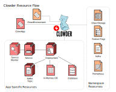
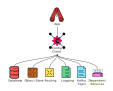

# Clowder Design

## Problem Statement

Engineers have a steep learning curve when they start writing their first
application for cloud.redhat.com, particularly if they're unfamiliar working in
a cloud-native environment before.

Additionally, enforcing standards and consistency across cloud.redhat.com
applications is difficult because of the number of disparate teams across the
enterprise that contribute to the ecosystem.

Similar to application consistency, it is difficult for engineers to be able to
handle the inconsistencies between environments, e.g local development versus
production.  While these differences can never be fully eliminated, ideally
developers would not have to devise their own solutions to handle these
differences.

## Mission

Clowder aims to abstract the underlying Kubernetes environment and configuration
to simplify the creation and maintenance of applications on cloud.redhat.com.

## Goals

* Abstract Kubernetes environment and configuration details from applications
* Enable engineers to deploy their application in every Kubernetes environment
   (i.e. dev, stage, prod) with minimal changes to their custom resources.
* Increase operational consistency between cloud.redhat.com applications,
   including rollout parameters and pod affinity.
* Handle metrics configuration and standard SLI/SLO metrics and alerts
* Some form of progressive deployment

## Non-goals

* Support applications outside cloud.redhat.com

## Proposal

Build a single operator that handles the common use cases that cloud.redhat.com
applications have.  These use cases will be encoded into the API of the
operator, which is of course CRDs.  There will be two CRDs:

* ``ClowdEnvironment``
This CRD represents an instance of the entire cloud.redhat.com environment,
e.g. stage or prod.  It contains configuration for various aspects of the
environment, implemented by *providers*.

* ``ClowdApp`` This CRD represents all the configuration an app needs to be deployed into
the cloud.redhat.com environment, including:

   * One or more deployment specs
   * Kafka topics
   * Databases
   * Object store buckets (e.g. S3)
   * In-memory DBs (e.g. Redis)
   * Public API endpoint name(s)
   * SLO/SLI thresholds

How these CRs will be translated into lower level resource types:

Apps will consume their environmental configuration from a JSON document mounted
in their app container.  This JSON document contains various configurations
that could be considered common across the platform or common kinds of resources
that would be requested by an app on the platform, including:

* Kafka topics
* Connection information for Kafka, object storage, databases, and in-memory DBs
* Port numbers for metrics and webservices
* Public API endpoint prefix

Common configuration interface:

## Alternatives

* One operator per app, perhaps with a shared library between them
  * While this proposal falls neatly in the "app teams are responsible for the
    operation of their app" mantra, the overhead of having each team build and
    maintain their own operator is considered too high.  The design proposed in
    this document helps draw the boundary between the responsibilities of the
    Cloud Dot platform team and the teams that build apps on that platform.

* One operator with a CRD for each app
  * While this would provide significantly more flexibility for teams to
    configure their apps, many app teams would not add any custom attributes,
    thus essentially making their custom CRDs boilerplate code.  In addition,
    teams that did in fact add custom fields would then have to maintain the
    code required to reconcile them.

The design proposed in this document is intentionally opinionated and makes
choices on behalf of apps because more often than not dev teams do not have
strong preferences on many operational aspects of their application.

## Validation

Clowder includes validating webhooks to ensure ClowdApp resources are properly configured before they are applied to the cluster. The following validations are performed:

### Duplicate Name Validation
ClowdApp names must be unique within each ClowdEnvironment. When creating a new ClowdApp, the validating webhook will check if another ClowdApp with the same name already exists in the same ClowdEnvironment and reject the request if a duplicate is found. This ensures uniqueness of ClowdApp names within each environment while allowing the same name to be used across different ClowdEnvironments.

### Database Configuration Validation
- Cannot set both `database.name` and `database.sharedDbAppName` simultaneously
- Cannot use Cyndi with a shared database

### Sidecar Validation
- Sidecar names must be one of the supported types: `token-refresher` or `otel-collector`
- This validation applies to both deployment and job sidecars

### Init Container Validation
- When multiple init containers are defined, each must have a unique name

### Deployment Strategy Validation
- Private strategy cannot be set to `Recreate` for deployments with public web services enabled

These validations help ensure proper configuration and prevent common misconfigurations that could cause deployment issues.
