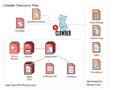

# Clowder Workflow

The Clowder operator takes much of the heavy lifting out of creating and 
maintaining applications on the Clouddot platform. Instead of an app developer
being responsible for authoring multiple resources and combining them into a
single k8s template, the Clowder app defines a simple ``ClowdApp`` resource
which not only defines the pods for the application, but also requests certain
key resources from the environment, such as Object Storage Buckets, a Database,
Kafka Topics, or an In Memory Database.

A ``ClowdEnvironment`` resource is used to define how key resources, such as
Kafka Topics and Databases are deployed. Using different providers, a single
``ClowdEnvironment`` can radically alter the way in which resources are
provisioned. For example, with regards to Kafka Topics, setting the ``provider``
to ``local`` will instruct Clowder to deploy a local Zookeeper/Kafka pod
and create topics inside it, but if the provider were set to `operator`, then
Clowder would instead drop a KafkaTopic custom resource ready for the Kafka
Strimzi operator to pick up and create topics.

The diagram below shows how the two Clowder resources are used to create all
other k8s resources.

Once these custom resources have been created and deployed to the k8s
environment, the operator will create a secret with all necessary configuration
data and expose it to the pods by mounting the JSON document in the app 
container. In this way, instead of an app configuring itself, the app is
configured instead by Clowder.

This has the advantage of creating consistency across deployments, whether
they are development, testing or production. It also creates a simple interface
for developers to onboard, producing a more streamlined developer experience.

The `ClowdApp` resource does not change when deploying into environments
configured with different `ClowdEnvironment` resources. Though the underlying
environmental resources, object storage, kafka, etc, may be provided through
different implementations, the configuration that is presented to the pod
remains consistent.

If the application is written in Python or Go, there is a client available
which further simplifies the process of obtaining configuration and offers
several helpers for accessing some of the more complex structures.

The diagram below describes how the application accesses the configuration.

